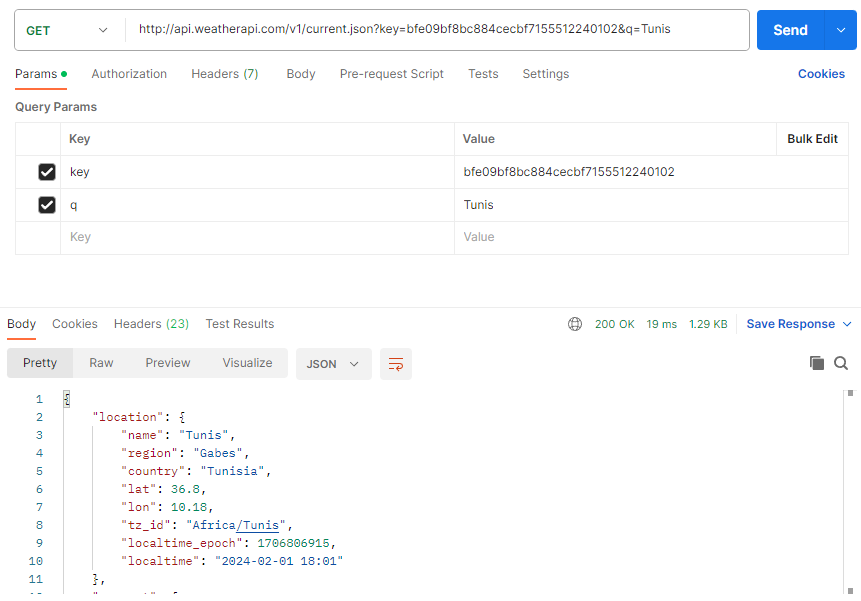

# Simple Weatrher API with Typescript
## Description du projet.

ApiWeather est un projet simplifié qui utilise Express et Axios pour interroger une API météorologique. Destiné à être exécuté dans un environnement Node.js, il permet aux développeurs et aux utilisateurs de Postman de récupérer facilement des données météorologiques en temps réel.

## Technologies Utilisées
- Express pour créer le serveur HTTP
- Axios pour faire des requêtes HTTP à l'API météorologique
- TypeScript pour ajouter une typage statique au code JavaScript
- ts-Node pour exécuter des scripts TypeScript directement sans compilation préalable

## Instruction d'installation
1. Clonez le dépôt : ` git clone https://github.com/LulDrako/ApiWeather`
2. Installez les dependencies : `npm install`
```bash
npm install express axios
npm install --save-dev typescript ts-node
npx tsc --init
```

## Configuration requise
- Node.js : Une version récente de Node.js est nécessaire
- NPM : Pour la gestion des paquets et l'installation des dépendances.
- TypeScript

## Comment Utiliser
Utilisez Postman pour envoyer des requêtes à l'API configurée via Express. Lancez le serveur avec ts-node et faites des requêtes pour obtenir des données météo.

```bash
`http://api.weatherapi.com/v1/current.json?key=${this.API_KEY}&q=${city}&lang=fr`
```

Pour plus d'informations sur l'API utilisée, visitez [WeatherAPI](https://www.weatherapi.com/).

